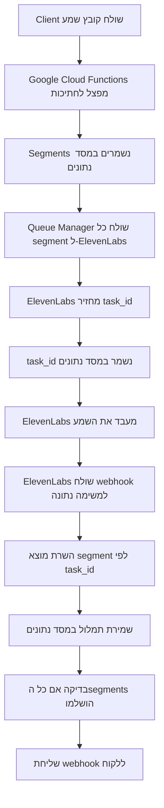

# ElevenLabs Webhook Setup Guide

## הבעיה שגילינו

הקוד שלנו ניסה לשלוח webhook URLs דינמית ל-ElevenLabs, אבל זה **לא איך ה-API של ElevenLabs עובד**.

לפי ה-documentation של ElevenLabs, webhook URLs חייבים להיות **מוגדרים מראש** ב-ElevenLabs Dashboard, ולא ניתן לשלוח אותם בבקשת ה-transcription.

## מה צריך לעשות

### 1. הגדרת Webhook ב-ElevenLabs Dashboard

1. **התחבר ל-ElevenLabs Dashboard**: https://elevenlabs.io/app/speech-synthesis
2. **עבור להגדרות Webhooks**: Profile → Settings → Webhooks  
3. **הוסף webhook URL חדש**:
   ```
   https://elevenlabs-bridge-henna.vercel.app/api/webhook/elevenlabs
   ```
4. **בחר את האירועים**: Speech-to-Text Completed
5. **שמור את ההגדרות**

### 2. איך הפייפליין עובד עכשיו



### 3. מה השתנה בקוד

#### לפני:
```typescript
// ❌ ניסה לשלוח webhook URL דינמית (לא עובד)
const webhookUrl = `${baseUrl}/api/webhook/elevenlabs?segmentId=${segmentId}`
await elevenLabsService.transcribeAudio(buffer, {
  webhookUrl: webhookUrl  // ElevenLabs מתעלם מזה!
})
```

#### אחרי:
```typescript
// ✅ פשוט מפעיל webhook mode - ElevenLabs משתמש ב-URL מוגדר מראש
await elevenLabsService.transcribeAudio(buffer, {
  webhook: true  // ElevenLabs ישלח ל-webhook שמוגדר ב-dashboard
})
```

### 4. איך למצוא segments לפי task_id

הקוד עכשיו משתמש במיפוי במסד הנתונים:

```sql
-- כל segment שומר את ה-ElevenLabs task_id
segments:
  id: "segment-uuid"
  elevenlabs_task_id: "el_task_12345"  -- זה מה שElevenLabs מחזיר
  
-- כשמגיע webhook עם task_id, מוצאים את ה-segment
SELECT * FROM segments WHERE elevenlabs_task_id = 'el_task_12345'
```

### 5. בדיקת הפייפליין המלא

אחרי הגדרת ה-webhook ב-ElevenLabs, בדוק:

```bash
# צור משימה חדשה
curl -X POST https://elevenlabs-bridge-henna.vercel.app/api/transcribe \
  -H 'Content-Type: application/json' \
  -d '{
    "webhookUrl": "https://elevenlabs-bridge-henna.vercel.app/api/webhook/elevenlabs",
    "filename": "audio1436646319.m4a", 
    "fileSize": 69649037
  }'

# המשימה תחזיר task_id
# חכה 45 שניות לGoogle Cloud Functions

# הפעל queue processing  
curl -X POST https://elevenlabs-bridge-henna.vercel.app/api/process-queue \
  -H 'Content-Type: application/json' \
  -d '{"maxJobs": 4}'

# חכה 5-10 דקות לElevenLabs

# בדוק תוצאות
curl https://elevenlabs-bridge-henna.vercel.app/api/status/TASK_ID
```

### 6. מה לחפש בלוגים

אחרי הגדרת ה-webhook תראה:

```json
// ✅ ElevenLabs webhook מגיע לשרת
{
  "message": "elevenlabs-webhook-received",
  "taskId": "el_task_12345",
  "status": "completed",
  "hasResult": true
}

// ✅ מוצא את ה-segment לפי task_id
{
  "message": "Processing ElevenLabs webhook",
  "elevenlabsTaskId": "el_task_12345",
  "segmentId": "segment-uuid-found"
}
```

## תוצאה צפויה

אחרי הגדרת ה-webhook ב-ElevenLabs Dashboard, הפייפליין אמור לעבוד מקצה לקצה:

1. ✅ Google Cloud Functions יפצל את השמע
2. ✅ Segments יישלחו ל-ElevenLabs  
3. ✅ ElevenLabs יחזיר task_ids
4. ✅ ElevenLabs ישלח webhooks לשרת שלנו
5. ✅ השרת יעדכן segments עם תמלול
6. ✅ תמלול מלא יישלח ללקוח

**הצעד החסר: הגדרת webhook ב-ElevenLabs Dashboard** 🎯 